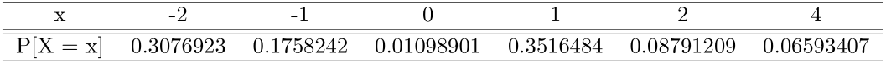
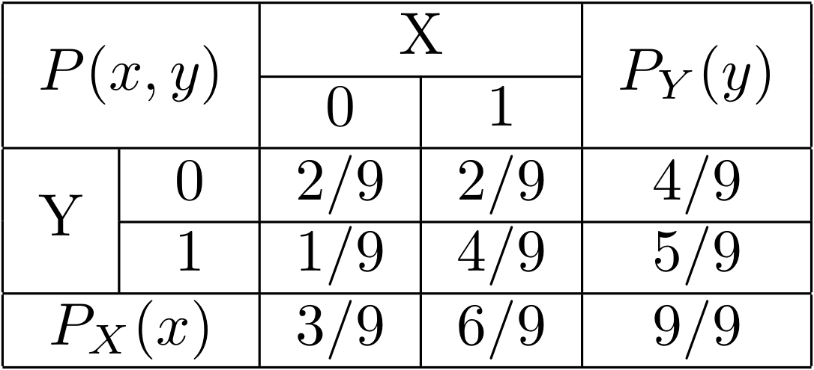

```{r setup, include=FALSE}
knitr::opts_chunk$set(echo = TRUE)
options(tinytex.verbose = TRUE)

list.of.packages <- c("knitr")
new.packages <- list.of.packages[!(list.of.packages %in% installed.packages()[,"Package"])]
if(length(new.packages)) install.packages(new.packages)

library("knitr")
```

**Note:** We have make usage of the "knitr" R package in order to display two useful image. Respectively the first time for exercise 4.1 of list 5 and the other one for exercise 6.1 of list 10. 

# List 1 - Exercise 3

Two dice are thrown. Let $E$ be the event that the sum of the dice is odd, let $F$ be the event that at least one of the dice lands on 1, and let $G$ be the event that the sum is 5. Describe the events $EF$, $E \cup F$, $FG$, $EF^c$, and $EFG$.

## \underline{Solution}

Let's first consider the single events. We represent as $(x,y)$ a pair of thrown dice, in which $x, y$ represent the number of each dice.

* $\begin{aligned}E = \{&(1,2),(1,4),(1,6),(2,1),(2,3),(2,5),(3,2),(3,4),(3,6),\\&(4,1),(4,3),(4,5),(5,2),(5,4),(5,6),(6,1),(6,3),(6,5)\}\end{aligned}$
* $F = \{(1,1),(1,2),(1,3),(1,4),(1,5),(1,6),(2,1),(3,1),(4,1),(5,1),(6,1)\}$
* $G = \{(1,4),(2,3),(3,2),(4,1)\}$

a) $EF$ can be interpreted as the **intersection** between the two events $E$ and $F$ thus it can be rewritten like so: $E \cap F$. Since it is an intersection we must keep only the common outcomes. Moreover we can describe this intersection as the event in which the sum of the dice is odd and at least one of the dice lands on 1.

$$
E \cap F= \{(1,2),(1,4),(1,6),(2,1),(4,1),(6,1)\}
$$

b) $E \cup F$ is the **union** between the two single event $E$ and $F$, so we have to maintain all the outcomes of both events considering the common ones only one time. We end up with this sequence of outcomes:

$$
\begin{aligned}
E \cup F = \{&(1,2),(1,4),(1,6),(2,1),(2,3),(2,5),(3,2),(3,4),(3,6),(4,1),
\\&(4,3),(4,5),(5,2),(5,4),(5,6),(6,1),(6,3),(6,5),(1,1),(1,3),(1,5),(3,1),(5,1)\}
\end{aligned}
$$

c) $FG$ can be interpreted as the **intersection** between the two events $F$ and $G$ thus it can be rewritten like so: $F \cap G$. Since it is an intersection we must keep only the common outcomes. Moreover we can describe this intersection as the event in which at least one of the dice lands on 1 and the sum of the two dice 5.

$$
F \cap G = \{(1,4),(4,1)\}
$$

d) $EF^c$ can be interpreted as the **intersection** between the two events $E$ and $F^c$ which is the **complement** of the event $F$. All of this can be rewritten like so: $E \cap F^c$. Furthermore, since it is an intersection we must keep only the common outcomes. We can describe this intersection as the event in which the sum of the dice is odd and no one of the two dice lands on 1. More interesting $E \cap F^c$ is also known as the difference between the two events: $E \setminus F$

$$
E \setminus F = E \cap F^c = \{(2,3),(2,5),(3,2),(3,4),(3,6),(4,3),(4,5),(5,2),(5,4),(5,6),(6,3),(6,5)\}
$$

e) $EFG$ can be interpreted as the **intersection** between the three events $E$, $F$ and $G$ thus it can be rewritten like so: $E \cap F \cap G$. Since it is an intersection we must keep only the common outcomes. Moreover we can describe this intersection as the event in which the sum of the dice is odd and at least one of the dice lands on 1 and the sum of the two dice is 5.

$$
E \cap F \cap G = \{(1,4),(4,1)\} = F \cap G
$$

# List 2 - Exercise 10

Consider an experiment that consists of 6 horses, numbered 1 through 6, running a race, and suppose that the sample space consists of the 6! possible orders in which the horses finish. Let:

* $A$ be the event that the number-1 horse is among the top three finishers
* $B$ be the event that the number-2 horse comes in second

How many outcomes are in the event $A \cup B$?

## \underline{Solution}

$|(A \cup B)|$ indeed is equal to:
$$|(A \cup B)| = |A| + |B| - |(A \cap B)|$$
Let's firstly solve separately each component of the union:

* $|A|$ is equal to all the possible permutations of horses with the number-1 fixed in the one of the top 3 positions, thus:
$$(6-1)! \times 3 = 360$$
* $|B|$ is equal to all possible permutations of horses with the number-2 fixed in the second position, thus:
$$(6-1)! = 120$$
* $|(A \cap B)|$ is equal to all the possible permutations of horses with the number-2 fixed in the second position and the number-1 that can take the first or third position, thus:
$(6-2)! \times 2 = 48$$

We conclude saying that the number outcomes of event $A \cup B$ is equal to:
$$|(A \cup B)| = |A| + |B| - |(A \cap B)| = 360 + 120 - 48 = 432$$

# List 3 - Exercise 3.38

Urn A has 5 white and 7 black balls. Urn B has 3 white and 12 black balls. We flip a fair coin. If the outcome is heads, then a ball from urn A is selected, whereas if the outcome is tails, then a ball from urn B is selected. Suppose that a white ball is selected. What is the probability that the coin landed tails?

## \underline{Solution}

By the description of this problem, we can consider the following events:

- A = {choosing the urn A}
- B = {choosing the urn B}
- W = {select the white ball}

Since the coin is fair, $$\mathbb{P}[A] = \mathbb{P}[B] = \frac{1}{2}$$ 
We are asked to determine the $$ \mathbb{P}[B | W] $$
From the Bayes theorem and the law of total probability, we can calculate:

$$
\begin{aligned}
\mathbb{P}[B|W] &= \frac{\mathbb{P}[W|B] \cdot \mathbb{P}[B]}{\mathbb{P}[W]} \\
&= \frac{\mathbb{P}[W|B] \cdot \mathbb{P}[B]}{\mathbb{P}[W|B]\cdot  \mathbb{P}[B] + \mathbb{P}[W|A]\cdot  \mathbb{P}[A]} \\
&= \frac{3/15 \cdot 1/2}{3/15 \cdot 1/2 + 5/12 \cdot 1/2} = \frac{12}{37}=0.324324324
\end{aligned}
$$

# List 4 - Exercise 3.21

If A flips $n + 1$ and B flips $n$ fair coins, show that the
probability that A gets more heads than B is $\frac{1}{2}$.

Hint: Condition on which player has more heads after each
has flipped n coins. (There are three possibilities.)

## \underline{Solution}

Let's define 3 random variables:

1) $A_{n+1}=$ "the number of heads of A in $n+1$ flips"

2) $A_{n}=$ "the number of heads of A in $n$ flips"

3) $B_{n}=$ "the number of heads of B in $n$ flips"

We want to prove that:
$$
\mathbb{P}(A_{n+1}>B_{n})=\frac{1}{2}
$$
After $n$ flips there are $3$ possibilities (events):

1) A has more heads than B: $A_{n}>B_{n}$

2) A has the same number of heads of B: $A_{n}=B_{n}$

3) A has less heads than B: $A_{n}<B_{n}$

These 3 events are mutually exclusive (only one of them can occur),
then:

$$\mathbb{P}(A_{n}>B_{n})+\mathbb{P}(A_{n}=B_{n})+\mathbb{P}(A_{n}<B_{n})=1$$.

Therefore we can write $\mathbb{P}(A_{n+1}>B_{n})$ using the law of total probability:

$$
\begin{aligned}
\mathbb{P}(A_{n+1}>B_{n})&=\mathbb{P}(A_{n+1}>B_{n}|A_{n}>B_{n})\mathbb{P}(A_{n}>B_{n}) \\
&+\mathbb{P}(A_{n+1}>B_{n}|A_{n}=B_{n})\mathbb{P}(A_{n}=B_{n}) \\
&+\mathbb{P}(A_{n+1}>B_{n}|A_{n}<B_{n})\mathbb{P}(A_{n}<B_{n})
\end{aligned}
$$
Now let's analyse each conditional probability:

1) $\mathbb{P}(A_{n+1}>B_{n}|A_{n}>B_{n})=1$: If A has more heads than B in n flips it is obvious that in the next flip A has still more heads than B (B does not flip).

2) $\mathbb{P}(A_{n+1}>B_{n}|A_{n}=B_{n})=\frac{1}{2}$: If A has the same number of heads of B in n flips, indeed the number of A's heads depends only on the next flip: $\mathbb{P}("head")$ from a fair coin is equal to $\frac{1}{2}$.

3) $\mathbb{P}(A_{n+1}>B_{n}|A_{n}<B_{n})=0$: If A has less heads than B in n flips it is obvious that in the next flip A has still less heads than B (if A has only an head less than B, in the next flip A can have the same number of heads than B or still less heads, but never more heads than B).


Therefore we can write $\mathbb{P}(A_{n+1}>B_{n})$ as follows:
$$
\begin{aligned}
\mathbb{P}(A_{n+1}>B_{n})&= 1 \cdot \mathbb{P}(A_{n}>B_{n})+\frac{1}{2} \cdot \mathbb{P}(A_{n}=B_{n})+0 \cdot \mathbb{P}(A_{n}<B_{n}) \\
&=\frac{1}{2} \cdot (2 \cdot \mathbb{P}(A_{n}>B_{n})+\mathbb{P}(A_{n}=B_{n}))
\end{aligned}
$$
We need to prove that $2 \cdot \mathbb{P}(A_{n}>B_{n})+\mathbb{P}(A_{n}=B_{n})=1$.

We can simply observe that $\mathbb{P}(A_{n}>B_{n})=\mathbb{P}(A_{n}<B_{n})$ because in n flips both players have the same probability of getting more heads than the other; therefore we can write $2 \cdot \mathbb{P}(A_{n}>B_{n})+\mathbb{P}(A_{n}=B_{n})$ as $\mathbb{P}(A_{n}>B_{n})+\mathbb{P}(A_{n}=B_{n})+\mathbb{P}(A_{n}<B_{n})$.

We know that $\mathbb{P}(A_{n}>B_{n})+\mathbb{P}(A_{n}=B_{n})+\mathbb{P}(A_{n}<B_{n})=1$ given that the 3 events are mutually exclusive, so:
$$
\begin{aligned}
\mathbb{P}(A_{n+1}>B_{n})&=\frac{1}{2} \cdot (2 \cdot \mathbb{P}(A_{n}>B_{n})+\mathbb{P}(A_{n}=B_{n})) \\
&=\frac{1}{2} \cdot (\mathbb{P}(A_{n}>B_{n})+\mathbb{P}(A_{n}=B_{n})+\mathbb{P}(A_{n}<B_{n})) \\
&=\frac{1}{2}
\end{aligned}
$$
This is what we had to prove.

# List 5 - Exercise 4.1

Two balls are chosen randomly from an urn containing 8 white, 4 black, and 2 orange balls. Suppose that we win 2 dollars for each black ball selected and we lose 1 dollar for each white ball selected. Let X denote our winnings. What are the possible values of X, and what are the probabilities associated with each value?

## \underline{Solution}

Firstly we let:

* O = an orange ball
* W = a white ball
* B = a black ball

Our possible experiment results of X are the following one:

* \{W, W\} = -2$
* \{W, O\} = -1$
* \{O, O\} = +0$
* \{B, W\} = +1$
* \{B, O\} = +2$
* \{B, B\} = +4$

Let X be the random variable denoting our winnings.

The the probability to obtain the previous events choosing two balls randomly from the urn of 14 balls is described by a combinations of taking the two balls, being x black balls out of 4 available, y white balls out of 8 available, and z orange balls out of 2 available.
$$\frac{\dbinom{4}{x}\dbinom{8}{y}\dbinom{2}{z}}{\dbinom{14}{2}}$$

$$\mathbb{P}[X = -2] = \mathbb{P}[\{W, W\}] =  \frac{\dbinom{4}{0}\dbinom{8}{2}\dbinom{2}{0}}{\dbinom{14}{2}} = 0.3076923$$
$$\mathbb{P}[X = -1] = \mathbb{P}[\{W, O\}] = \frac{\dbinom{4}{0}\dbinom{8}{1}\dbinom{2}{1}}{\dbinom{14}{2}} = 0.1758242$$
$$\mathbb{P}[X = 0] = \mathbb{P}[\{O, O\}] = \frac{\dbinom{4}{0}\dbinom{8}{0}\dbinom{2}{2}}{\dbinom{14}{2}} = 0.01098901$$
$$\mathbb{P}[X = 1] = \mathbb{P}[\{B, W\}] = \frac{\dbinom{4}{1}\dbinom{8}{1}\dbinom{2}{0}}{\dbinom{14}{2}} = 0.3516484$$
$$\mathbb{P}[X = 2] = \mathbb{P}[\{B, O\}] = \frac{\dbinom{4}{1}\dbinom{8}{0}\dbinom{2}{1}}{\dbinom{14}{2}} = 0.08791209$$
$$\mathbb{P}[X = 4] = \mathbb{P}[\{B, B\}]  = \frac{\dbinom{4}{2}\dbinom{8}{0}\dbinom{2}{0}}{\dbinom{14}{2}} =  0.06593407$$


We can summarize the probability distribution function with the following table:

```{r, echo=FALSE, out.width = '75%', fig.align="center"}

```

# List 6 - Exercise 4.11

Teams $A$ and $B$ play a series of games, with the first team to win 3 games being declared the winner of the series. Suppose that team $A$ independently wins each game with probability $p$. Find the conditional probability that team $A$ wins:

a) the series given that it wins the first game
b) the first game given that it wins the series

## \underline{Solution}
Let's first define some useful events to solve the exercise:

* $A_{series}$ = \{team $A$ win the series of games\}
* $A_{first}$ = \{team $A$ win the first game of the series\}

Moreover we remark that $A$ wins each game independently with probability $p$, thus loose or, in other words, $B$ wins with probability $1-p$.

a) The first point ask us to find:
$$
\mathbb{P}[A_{series} | A_{first}]
$$
Which can be re-written into what follow:
$$
\mathbb{P}[A_{series} | A_{first}] = \frac{\mathbb{P}[A_{series} \cap A_{first}]}{\mathbb{P}[A_{first}]}
$$
By the exercise text we know that the \(\mathbb{P}[A_{first}]\) is equal to the probability of win of \(A\) which is equal to \(p\).
Now the possible combination with the associate probability \(\mathbb{P}[A_{serie} \cap A_{first}]\) are the following:

* A AA with probability $p^3$
* A ABA with probability $p^3(1-p)$
* A BAA with probability $p^3(1-p)$
* A ABBA with probability $p^3(1-p)^2$
* A BABA with probability $p^3(1-p)^2$
* A BBAA with probability $p^3(1-p)^2$

And the sum of this probabilities is:
$$p^3 + 2p^3(1-p) + 3p^3(1-p)^2 = p(p^2 + 2p^2(1-p) + 3p^2(1-p)^2)$$

In conclusion:
$$
\mathbb{P}[A_{serie} | A_{first}] = \frac{p(p^2 + 2p^2(1-p) + 3p^2(1-p)^2)}{p} = p^2 + 2p^2(1-p) + 3p^2(1-p)^2
$$

b) On the other hand the second point ask us to find:
$$
\mathbb{P}[A_{first}|A_{series}]
$$
In which using the Bayes rule it is equal to:
$$
\mathbb{P}[A_{first}|A_{series}] = \frac{\mathbb{P}[A_{series}|A_{first}] \cdot \mathbb{P}[A_{first}]}{\mathbb{P}[A_{series}]}
$$
The only value that remain to calculate is \(\mathbb{P}[A_{series}]\). In this case we have:

* Team A wins three games in a row, with probability $p^3$
* Team A wins three games and Team B wins one game, with probability $3p^3(1-p)$
* Team A wins three games and Team B wins two games, with probability $\binom{4}{2}p^3(1-p)^2$

Then,

$$
\mathbb{P}[A_{serie}] = p^3 + 3p^3(1-p) + \binom{4}{2}p^3(1-p)^2
$$

Finally, 

$$
\mathbb{P}[A_{first}|A_{series}] = \frac{\mathbb{P}[A_{series}|A_{first}] \cdot \mathbb{P}[A_{first}]}{\mathbb{P}[A_{series}]} = \frac{(p^2 + 2p^2(1-p) + 3p^2(1-p)^2)p}{p^3 + 3p^3(1-p) + \binom{4}{2}p^3(1-p)^2}
$$

# List 7 - Exercise 5.16

The annual rainfall (in inches) in a certain region is normally distributed with $\mu = 40$ and $\sigma = 4$. What is the probability that starting with this year, it will take more than 10 years before a year occurs having a rainfall of more than 50 inches? What assumptions are you making?

## \underline{Solution}

The annual rainfall is described by the random variable $X \sim N(\mu, \sigma^2)$, so $X \sim N(40, 4^2)$. In order to answer the first question, we first calculate the probability that an annual rainfall exceeds 50 inches:

$$
\mathbb{P}[X > 50] = \mathbb{P}\Bigg[Z > \frac{50 - \mu}{\sigma}\Bigg] = P[Z > 2.5] = \text{pnorm(2.5, lower.tail = FALSE)} = 0.0062
$$

Then, we can model the number of years before a year with rainfall exceeding 50 inches with the variable $Y \sim Geom(p)$, where $p$ is the probability of success, in this case $p = 0.0062$. Finally, we can answer the question of the problem by calculating:

$$
\mathbb{P}[Y > 10] = 1 - \text{pgeom(9, 0.0062) = 0.9397}
$$

The assumption is that the annual rainfall is independent year to year.


# List 8 - Exercise 5.22

Let U be a uniform $(0, 1)$ random variable, and let
$a < b$ be constants.

(a) Show that if $b > 0$, then $bU$ is uniformly distributed
on $(0, b)$, and if $b < 0$, then $bU$ is uniformly distributed on
$(b, 0)$.

(b) Show that $a + U$ is uniformly distributed on $(a, 1 + a)$.

(c) What function of $U$ is uniformly distributed on $(a, b)$?

(d) Show that $min(U, 1 - U)$ is a uniform $(0, 1/2)$ random
variable.

(e) Show that $max(U, 1 - U)$ is a uniform $(1/2, 1)$ random
variable.

## \underline{Solution}

Let $U \sim U(0,1)$ with PDF:

$$
f_U(x)= 
\begin{cases}
1, & x \in [0,1] \\
0, & \text{otherwise}
\end{cases}
$$
and CDF:
$$
F_U(x)= 
\begin{cases}
0, & x<0 \\ 
x, & x \in [0,1] \\
1, & x >1
\end{cases}
$$

a.1) We have to prove that if $b>0$ then $Y=bU \sim U(0,b)$

First we calculate the interval extremes:

* if $U=0$ then $Y=0$

* if $U=1$ then $Y=b$

We calculate the CDF:

$F_Y(y)=P(Y \le y)=P(bU \le y)=P(U \le \frac{y}{b})=F_U(\frac{y}{b})=\frac{y}{b}$

Given that $\frac{\partial F}{\partial y}=\frac{1}{b}$ we derive the PDF:
$$
f_Y(y) = 
\begin{cases}
\frac{1}{b}, & y \in [0,b] \\
0, & \text{otherwise}
\end{cases}
$$
which in turn is a $U(0,b)$ by definition.

a.2) We have to prove that if $b<0$ then $Y=bU \sim U(b,0)$

First we calculate the interval extremes:

* if $U=0$ then $Y=0$

* if $U=1$ then $Y=b$

We calculate the CDF:

$F_Y(y)=P(Y \le y)=P(bU \le y)=P(U \ge \frac{y}{b})=1-F_U(\frac{y}{b})=1-\frac{y}{b}$

Given that $\frac{\partial F}{\partial y}=\frac{-1}{b}$ we derive the PDF:
$$
f_Y(y) = 
\begin{cases}
\frac{-1}{b}, & y \in [b,0] \\
0, & \text{otherwise}
\end{cases}
$$
which in turn is a $U(b,0)$ by definition.

b) We have to prove that $Y=a+U \sim U(a,1+a)$

First we calculate the interval extremes:

* if $U=0$ then $Y=a$

* if $U=1$ then $Y=1+a$

We calculate the CDF:

$F_Y(y)=P(Y \le y)=P(a+U \le y)=P(U \le y-a)=F_U(y-a)=y-a$

Given that $\frac{\partial F}{\partial y}=1$ we derive the PDF:
$$
f_Y(y) = 
\begin{cases}
1, & y \in [a,1+a] \\
0, & \text{otherwise}
\end{cases}
$$
which in turn is a $U(a,1+a)$ by definition.

c) We have to find the function $g(.)$ such that $g(U) \sim U(a,b)$

Let $Y \sim U(a,b)$ with CDF:
$$
F_Y(y) = 
\begin{cases}
0, & y<a \\
\frac{y-a}{b-a}, & y \in [a,b] \\
1, & y>b
\end{cases}
$$
Given that $p=\frac{y-a}{b-a}$ is a probability, we know that $p$ takes values between 0 and 1. $p$ can be seen as a Standard Uniform distribution ($p=U$).

Indeed, we calculate $y=F^{-1}_Y(p)$:

$$
p=\frac{y-a}{b-a} \Rightarrow
p \times (b-a)=y-a \Rightarrow
p \times (b-a)+a=y
$$
The function that transforms a Standard Uniform in a $U(a,b)$ is indeed $g(U)=U \times (b-a)+a$


d) We have to prove that $Y=min(U,1-U) \sim U(0,1/2)$

We distinguish two cases:

1) if $U \ge \frac{1}{2}$ then the min is $Y=1-U$
2) if $U \le \frac{1}{2}$ then the min is $Y=U$

1 ) First we calculate the interval extremes:

* if $U=\frac{1}{2}$ then $Y=\frac{1}{2}$

* if $U=1$ then $Y=0$

We calculate the CDF:

$F_Y(y)=P(Y \le y)=P(1-U \le y)=P(-U \le y-1)=P(U \ge -y+1)=1-P(U \le 1-y)=1-F_U(1-y)=1-1+y=y$

Given that $\frac{\partial F}{\partial y}=1$ we derive the PDF:
$$
f_Y(y) = 
\begin{cases}
1, & y \in [0,\frac{1}{2}] \\
0, & \text{otherwise}
\end{cases}
$$
which in turn is a $U(0,\frac{1}{2})$ by definition.

2 ) First we calculate the interval extremes:

* if $U=0$ then $Y=0$

* if $U=\frac{1}{2}$ then $Y=\frac{1}{2}$

We calculate the CDF:

$F_Y(y)=P(Y \le y)=P(U \le y)=F_U(y)=y$

Given that $\frac{\partial F}{\partial y}=1$ we derive the PDF:
$$
f_Y(y) = 
\begin{cases}
1, & y \in [0,\frac{1}{2}] \\
0, & \text{otherwise}
\end{cases}
$$
which in turn is a $U(0,\frac{1}{2})$ by definition.


e) We have to prove that $Y=max(U,1-U) \sim U(\frac{1}{2},1)$

We distinguish two cases:

1) if $U \ge \frac{1}{2}$ then the max is $Y=U$
2) if $U \le \frac{1}{2}$ then the max is $Y=1-U$

1 ) First we calculate the interval extremes:

* if $U=1$ then $Y=1$

* if $U=\frac{1}{2}$ then $Y=\frac{1}{2}$

We calculate the CDF:

$F_Y(y)=P(Y \le y)=P(U \le y)=F_U(y)=y$

Given that $\frac{\partial F}{\partial y}=1$ we derive the PDF:
$$
f_Y(y) = 
\begin{cases}
1, & y \in [\frac{1}{2},1] \\
0, & \text{otherwise}
\end{cases}
$$
which in turn is a $U(\frac{1}{2},1)$ by definition.

2 ) First we calculate the interval extremes:

* if $U=0$ then $Y=1$

* if $U=\frac{1}{2}$ then $Y=\frac{1}{2}$

We calculate the CDF:

$F_Y(y)=P(Y \le y)=P(1-U \le y)=P(-U \le y-1)=P(U \ge -y+1)=1-P(U \le 1-y)=1-F_U(1-y)=1-1+y=y$

Given that $\frac{\partial F}{\partial y}=1$ we derive the PDF:
$$
f_Y(y) = 
\begin{cases}
1, & y \in [\frac{1}{2},1] \\
0, & \text{otherwise}
\end{cases}
$$
which in turn is a $U(\frac{1}{2},1)$ by definition.


# List 9 - Exercise 6.22

The joint density function of X and Y is
$$
f(x,y) = 
\begin{cases}
x + y, & 0 < x < 1, 0 < y < 1 \\
0, & \text{otherwise}
\end{cases}
$$

a) Are $X$ and $Y$ independent?
b) Find the density function of $X$.
c) Find $P\{X + Y < 1\}$

## \underline{Solution}

a) The joint density function is given, so in order to find if $X$ and $Y$ are independent firstly we have to find the two marginal distribution: $f_{X}(x)$ and $f_{Y}(y)$ and then verify if the multiplication of the two gives us the $f_{X,Y}(x,y)$. If this holds we conclude saying X and Y are independent. Let's find out:
$$f_{X}(x) = \int_a^b f_{X,Y}(x,y) \,dy = \int_0^1 (x + y) \,dy = \Bigg[xy + \frac{y^2}{2}\Bigg]_0^1 = \Bigg(x + \frac{1}{2} \Bigg)$$
$$f_{Y}(y) = \int_a^b f_{X,Y}(x,y) \,dx = \int_0^1 (x + y) \,dx = \Bigg[xy + \frac{x^2}{2}\Bigg]_0^1 = \Bigg(y + \frac{1}{2} \Bigg)$$
And
$$f_{X}(x) \times f_{Y}(y) = \Bigg(x + \frac{1}{2} \Bigg) \cdot \Bigg(y + \frac{1}{2} \Bigg) = \frac{4xy + 2x +y +1}{4} \neq f_{X,Y}(x,y)$$
Thus $X$ and $Y$ are not independent.

b) From the previous point we remark the the result of density function of $X$, which is $f_{X}(x)$ is equal to:
$$\Bigg(x + \frac{1}{2} \Bigg)$$

c) Finally in the last point of the exercise we have to find the $P\{X + Y < 1\}$, thus in order to do this we have to integrate twice the joint PDF taking care on the range of $x$ and $y$, indeed if we let $y$ taking any value in its domain, so $0 < y < 1$, $x$ have to take into account the variation of $y$, so:
$$
\begin{cases}
0 < x < 1\\
x + y < 1
\end{cases}
$$
And moving the $y$ to the right part of the second inequality we obtain a single inequality:
$$0 < x < 1-y$$
Knowing that, now we can find the required probability:
$$
\begin{aligned}
P\{X + Y < 1\} &= \int_0^1 \int_0^{1-y}f_{X,Y}(x,y) \, dxdy = \int_0^1 \int_0^{1-y} (x + y) \, dxdy
\\&=\int_0^1\Big[\frac{x^2}{2} + xy \Big]_0^{1-y} \, dy = \int_0^1 \frac{(1-y)^2}{2} + y(1-y) \, dy 
\\&=\Big[ \frac{y^3}{6} - \frac{y^2}{2} + \frac{y}{2} + \frac{y^2}{2} - \frac{y^3}{3} \Big]_0^1 = \frac{1}{3}
\end{aligned}
$$

# List 10 - Exercise 6.1

Each throw of an unfair die lands on each of the odd numbers 1, 3, 5 with probability C and on each of the even numbers with probability 2C.

a) Find C.
b) Suppose that the die is tossed. Let X equal 1 if the result is an even number, and let it be 0 otherwise. Also, let Y equal 1 if the result is a number greater than three and let it be 0 otherwise. Find the joint probability mass function of X and Y. Suppose now that 12 independent tosses of the die are made.
c) Find the probability that each of the six outcomes occurs exactly twice.
d) Find the probability that 4 of the outcomes are either one or two, 4 are either three or four, and 4 are either five or six.
e) Find the probability that at least 8 of the tosses land on even numbers.

## \underline{Solution}
Let $D$ be the random variables that represents the result of the tossing, which can take values between 1 and 6.

a) In order to find C, we must set the condition $3(C + 2C) = 1$, from which we derive $C = \frac{1}{9}$.

b) The joint pdf of X and Y is given by:

* $P[X = 0, Y = 0] = P[\text{result is odd and less or equal than 3}] = P[D = 1] + P[D = 3] = \frac{2}{9}$

* $P[X = 0, Y = 1] = P[\text{result is odd and greather than 3}] = P[D = 5] = \frac{1}{9}$

* $P[X = 1, Y = 0] = P[\text{result is even and less or equal than 3}] = P[D = 2] = \frac{2}{9}$

* $P[X = 1, Y = 1] = P[\text{result is even and greather than 3}] = P[D = 4] + P[D = 6] = \frac{4}{9}$

We can represent the joint pdf in the following table:

```{r, echo=FALSE, out.width = '30%', fig.align="center"}

```


c) The total ways of getting two ones, two twos etc.. can be calculated using the permutations with repetition formula: 

$$
P_{n}^{n_1,n_2,...,n_k} = P_{12}^{2,2,2,2,2,2} = \frac{12!}{(2!)^6} = \frac{12!}{2^6}
$$

Then, in order to answer the question we have to multiply the number of permutations by the probability of getting a single one, which is equal of getting 6 odd numbers and 6 even numbers.

$$
\mathbb{P}[\text{each outcome exactly twice}] = \frac{12!}{2^6} \cdot (P_X(X = 0))^6 \cdot (P_X(X = 1))^6 = \frac{12!}{2^6} \cdot \bigg(\frac{1}{3}\bigg)^6 \cdot \bigg(\frac{2}{3}\bigg)^6 
$$

d) We first calculate the probability of getting a number between 1, 3 or 5 and a number between 2, 4 or 6: $\mathbb{P}[\text{1 or 3 or 5}] + \mathbb{P}[\text{2 or 4 or 6}] = \frac{1}{9} + \frac{2}{9} = \frac{1}{3}$. Then, using the permutations with repetition we calculate the total number of ways of getting 4 outcomes with either one or two, 4 outcomes with either three or four and 4 outcomes with either five or six: $P_{12}^{4,4,4} = \frac{12!}{4! 4!4!}$. Finally, we multiply the probabilities:

$$
p = \frac{12!}{4! 4!4!} \cdot \bigg(\frac{1}{3}\bigg)^{12}
$$

e) The probability of getting an even number is given by $p = \frac{2}{3}$. Let $X$ be a random variable that counts the number of even number from 12 throws, then $X \sim Bin(12, p)$. In order to answer the question we must calculate:

$$
\mathbb{P}[X \geq 8] = pbinom(7, 12, \frac{2}{3}, lower.tail = FALSE)= 0.6315
$$

# List 11 - Exercise 7.19

A certain region is inhabited by $r$ distinct types of a
certain species of insect. Each insect caught will, independently
of the types of the previous catches, be of type $i$ with
probability:
$$
P_i \quad \text{with } i = 1,...,r \quad \sum_i^r P_i = 1 
$$

a) Compute the mean number of insects that are caught before the first type 1 catch.
b) Compute the mean number of types of insects that are caught before the first type 1 catch.

## \underline{Solution}

a) The number of insects that are caught before the first type 1 catch is given by $X - 1$, where $X \sim Geom(P_1)$, so the mean number is given by:

$$
E[X - 1] = E[X] - 1 = \frac{1}{P_1} - 1
$$

b) For $i = 2,..,r$ we introduce the following variable $Y_i$:

$$
Y_i = 
\begin{cases}
  1, & \text{if type } i \text{ is caught before the first type 1 catch}  \\
  0, & \text{otherwise}
\end{cases}
$$

Then, $B = \sum \limits_{i = 2}^r Y_i$ represents the number of types of insects that are caught before the first type 1 catch. Therefore, the mean number of $B$ is given by:

$$
E[B] = E[\sum \limits_{i = 2}^r Y_i] = \sum \limits_{i = 2}^r E[Y_i] = \sum \limits_{i = 2}^r \mathbb{P}[Y_i = 1] = \sum \limits_{i = 2}^r \mathbb{P}[X_i \geq 1]
$$
, where $X_i$ denotes the number of insects of type $i$ before the first type 1 catch. From the point a) we have that $X \sim Geom(P_1)$ represents the number of insects that are caught before the first type 1 catch, and we can notice that $\{X_i \geq 1, X = x \}$ are disjoint and exhaustive events. Thus, so we can write $\mathbb{P}[X_i \geq 1]$ as follows:

$$
\begin{aligned}
\mathbb{P}[X_i \geq 1] &= \sum \limits_{x = 0}^ \infty \mathbb{P}[X_i \geq 1, X = x] \\
&= \sum \limits_{x = 0}^ \infty \mathbb{P}[X = x] - \mathbb{P}[X_i = 0, X = x] \\ 
&= \sum \limits_{x = 0}^ \infty \mathbb{P}[X = x] - \sum \limits_{x = 0}^ \infty \mathbb{P}[X_i = 0, X = x] \\ 
&= \sum \limits_{x = 0}^ \infty (1 - P_1)^x P_1 - \sum \limits_{x = 0}^ \infty (1 - P_1 - P_i)^xP_1
\end{aligned}
$$

Using the formula for a geometric series, we get

$$
\mathbb{P}[X_i \geq 1] = \frac{P_1}{P_1} - \frac{P_1}{P_1 + P_i} = \frac{P_i}{P_1 - P_i}
$$

Finally, we have that the mean number of types of insects that are caught before the first type 1 catch is given by 

$$
E[B] = \sum \limits_{i = 2}^r \mathbb{P}[X_i \geq 1] = \sum \limits_{i = 2}^r \frac{P_i}{P_1 - P_i}
$$
