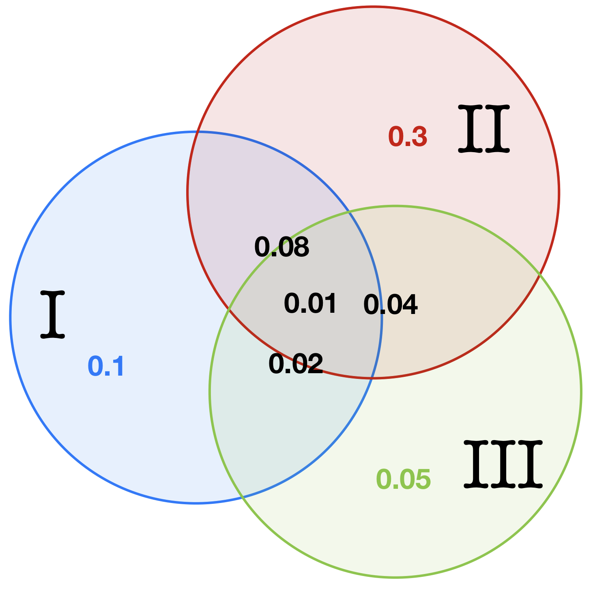

```{r setup, include=FALSE}
knitr::opts_chunk$set(echo = TRUE)
options(tinytex.verbose = TRUE)
library("knitr")
```


1) 13---R OK
2) 10------G OK
3) 3.38--------N OK
4) 3.21------------M Kinda
5) 4.1--R OK
6) 4.11----G
7) 5.16--------N OK	
8) 5.22------------M OK
9) 6.22-R	OK
10) 6.1----G	
11) 7.19-------N OK


# List 1 - Exercise 13

A certain town with a population of 100,000 has 3 newspapers: I, II, and III. The proportions of townspeople who read these papers are as follows:

1. I: 10 percent 
2. I and II: 8 percent 
3. I and II and III: 1 percent
4. II: 30 percent 
5. I and III: 2 percent
6. III: 5 percent
7. II and III: 4 percent

(The list tells us, for instance, that 8000 people read newspapers I and II.)

a) Find the number of people who read only one newspaper.
b) How many people read at least two newspapers?
c) If I and III are morning papers and II is an evening paper, how many people read at least one morning paper plus an evening paper?
d) How many people do not read any newspapers?
e) How many people read only one morning paper and one evening paper?

## \underline{Solution}

Firstly we define the following events:

* A = \{\text{People who read only one newspaper}\}
* B = \{\text{People who read at least two newspapers}\}
* C = \{\text{People who read at least one morning paper plus an evening pape}\}
* D = \{\text{People who do not read any newspapers}\}
* E = \{\text{People who read only one morning paper and one evening paper}\}
* I = \{\text{People who read newspaper I}\}
* II = \{\text{People who read newspaper II}\}
* III = \{\text{People who read newspaper III}\}

Moreover to better explain the solution we rewrite in mathematical language all the proportion of all combination of townspeople who read newspaper I, II and III as follow
\[\mathbb{P}[I] = 0.1 \quad \mathbb{P}[II] = 0.3 \quad \mathbb{P}[III] = 0.05\]
\[\mathbb{P}[I \cap II] = 0.08 \quad \mathbb{P}[I \cap III] = 0.02 \quad \mathbb{P}[II \cap III] = 0.04 \quad \mathbb{P}[I \cap II \cap III] = 0.01 \quad\]

And finally we draw a picture i in order to have a visual understanding of the subdivision of all probabilities:
```{r  out.width = "40%", echo = FALSE, fig.align = "center"}
# 
```

\begin{center}
\begin{tikzpicture}
  \tikzset{venn circle/.style={draw,circle,minimum width=7cm,fill=#1,opacity=0.4}}

  \node [venn circle = red] (A) at (0,0) {$I$};
  \node [venn circle = blue] (B) at (65:4cm) {$II$};
  \node [venn circle = green] (C) at (0:4cm) {$III$};
  \node[left] at (barycentric cs:A=1/2,B=1/2 ) {$I \cap II$}; 
  \node[below] at (barycentric cs:A=1/2,C=1/2 ) {$I \cap III$};   
  \node[right] at (barycentric cs:B=1/2,C=1/2 ) {$II \cap III$};   
  \node[below] at (barycentric cs:A=1/3,B=1/3,C=1/3 ){$I \cap II \cap III$};
\end{tikzpicture}  
\end{center}


a) To solve the first point we define three additional sub-events of event A:
* \(A_{I} = \)\{\text{People who read only the newspaper }I\}
* \(A_{II} = \)\{\text{People who read only the newspaper }II\}
* \(A_{III} = \)\{\text{People who read only the newspaper }III\}

Indeed the \(\mathbb{P}[A]\) is nothing else that the sum of \(\mathbb{P}[A_I] + \mathbb{P}[A_{II}] + \mathbb{P}[A_{III}]\). Now we note by the previous figure we have all what we need. To obtain the probability of one of the three sub-events we have to take the probability that a person read that newspaper subtracting the two intersection with the other newspaper and add the intersection of all three since we have subtracted that amount twice. More clearly:

\[\mathbb{P}[A_I] = \mathbb{P}[I] - \mathbb{P}[I \cap II] - \mathbb{P}[I \cap III] + \mathbb{P}[I \cap II \cap III]\]
\[\mathbb{P}[A_I] = 0.1 - 0.08 - 0.02 + 0.01 = 0.01\]

Similarly for the other two sub-events we have:

\[\mathbb{P}[A_{II}] = \mathbb{P}[II] - \mathbb{P}[II \cap I] - \mathbb{P}[II \cap III] + \mathbb{P}[I \cap II \cap III]\]
\[\mathbb{P}[A_{II}] = 0.3 - 0.08 - 0.02 + 0.04 = 0.24\]

\[\mathbb{P}[A_{III}] = \mathbb{P}[III] - \mathbb{P}[III \cap I] - \mathbb{P}[III \cap II] + \mathbb{P}[I \cap II \cap III]\]
\[\mathbb{P}[A_{III}] = 0.05 - 0.02 - 0.04 + 0.01 = 0.00\]

Thus we obtain that:

\[\mathbb{P}[A] = \mathbb{P}[A_I] + \mathbb{P}[A_{II}] + \mathbb{P}[A_{III}]\]
\[\mathbb{P}[A] = 0.01 + 0.24 + 0.00 = 0.25\]

Finally the number of people who read only one newspaper is \(\mathbb{P}[A] \times 100000 = 0.25 \times 100000 = 25000\)

b) In order to solve the second point we look again at the drawn figure and we see that again we have all what we need. Indeed we want to take into account all the intersection of people that read **at least** two newspaper and since each intersection consider two times the intersection of all of three newspaper we have to subtract that amount. Moreover as the previous point we introduce again three sub-events, so let:
* \(B_{I \cap II \cap III^c} = \)\{\text{People who read the newspaper }I \text{ and }II \text{ but not }III\}
* \(B_{I^c \cap II \cap III} = \)\{\text{People who read at least the newspaper }II \text{ and }III \text{ but not }I\}
* \(B_{I \cap II^c \cap III} = \)\{\text{People who read at least the newspaper }III \text{ and }I\text{ but not }II\}
* \(B_{I \cap II \cap III} = \)\{\text{People who read at least the newspaper }I \text{, }II \text{ and }III\}

Thus
\[\mathbb{P}[B] = \mathbb{P}[B_{I \cap II \cap III^c}] + \mathbb{P}[B_{I^c \cap II \cap III}] + \mathbb{P}[B_{I \cap II^c \cap III}] + \mathbb{P}B_{I \cap II \cap III}]\]

\[\mathbb{P}[B_{I \cap II \cap III^c}] = \mathbb{P}[I \cap II] - \mathbb{P}[I \cap II \cap III] \]
\[\mathbb{P}[B_{I \cap II \cap III^c}] = 0.08 - 0.01 = 0.07\]

\[\mathbb{P}[B_{I^c \cap II \cap III}] = \mathbb{P}[II \cap III] - \mathbb{P}[I \cap II \cap III] \]
\[\mathbb{P}[B_{I^c \cap II \cap III}] = 0.04 - 0.01 = 0.03\]

\[\mathbb{P}[B_{I \cap II^c \cap III}] = \mathbb{P}[I\cap III] - \mathbb{P}[I \cap II \cap III] \]
\[\mathbb{P}[B_{I \cap II^c \cap III}] = 0.02 - 0.01 = 0.01\]

\[\mathbb{P}[B_{I \cap II \cap III}] = \mathbb{P}[I \cap II \cap III] = 0.01\]


So
\[\mathbb{P}[B] = 0.07 + 0.03 + 0.01 + 0.01 = 0.12\]

Finally the number of people who read at least two newspaper is \(\mathbb{P}[B] \times 100000 = 0.12 \times 100000 = 12000\)


c) In this point we to retrieve how many people read at least one morning paper plus an evening paper, thus all of this can be re-write into the probability to read one of the morning newspaper **or** both, **and** the evening newspaper. More formally we want to obtain:
\[
\mathbb{P}[C] = \mathbb{P}[(I \cup III) \cap II] = (\mathbb{P}[I] + \mathbb{P}[III] - \mathbb{P}[I \cap III]) \cap \mathbb{P}[II]\]
\[= \mathbb{P}[I \cap II] + \mathbb{P}[III \cap II] - \mathbb{P}[I \cap II \cap III]\]
\[= 0.08 + 0.04 - 0.01 = 0.11
\]
Finally the number of people who read read at least one morning paper plus an evening paper is \(\mathbb{P}[C] \times 100000 = 0.11 \times 100000 = 11000\)

d) The \(\mathbb{P}[D]\) can be rewritten into \(1 - \mathbb{P}[I \cup II \cup III]\), thus:
\[
\mathbb{P}[D] = 1 - \mathbb{P}[I \cup II \cup III]\]
\[= 1 - \Big(\mathbb{P}[I] + \mathbb{P}[II] + \mathbb{P}[III] - \mathbb{P}[I \cap II] - \mathbb{P}[II \cap III] - \mathbb{P}[III \cap I] + \mathbb{P}[I \cap II \cap III] \Big)\]
\[= 1 - \Big(0.1 + 0.3 + 0.05 - 0.08 - 0.04 - 0.02 + 0.01 \Big) = 0.68
\]
Thus the number of people who do not read any newspaper is \(\mathbb{P}[D] \times 100000 = 0.68 \times 100000 = 68000\)

e) This point is similar to the point "c" except the case that we have to exclude the intersection between the two morning newspaper. More formally:
\[\mathbb{P}[C] = \mathbb{P}\Big[\Big((I - III) \cup (III - I)\Big) \cap II\Big] = \mathbb{P}\Big[\Big((I \cap III^c) \cup (III \cap I^c)\Big) \cap II\Big]\]
\[= \mathbb{P}[I \cap II \cap III^c] + \mathbb{P}[I^c \cap II \cap III] = \Big(\mathbb{P}[I \cap II] - \mathbb{P}[I \cap II \cap III]\Big) + \Big(\mathbb{P}[II \cap III] -\mathbb{P}[I \cap II \cap III]\Big)\]
\[= \mathbb{P}[I \cap II] + \mathbb{P}[II \cap III] -2\mathbb{P}[I \cap II \cap III]\]
\[= 0.08 + 0.04 - 2 \times 0.01 = 0.1\]

Finally the number of people who read only one morning paper and one evening paper is \(\mathbb{P}[E] \times 100000 = 0.1 \times 100000 = 10000\)


# List 2 - Exercise 10

Consider an experiment that consists of 6 horses, numbered 1 through 6, running a race, and suppose that the sample space consists of the 6! possible orders in which the horses finish. Let:

* \(A\) be the event that the number-1 horse is among the top three finishers
* \(B\) be the event that the number-2 horse comes in second

How many outcomes are in the event \(A \cup B\)?

## \underline{Solution}

\(\#(A \cup B)\) indeed is equal to:
\[\#(A \cup B) = \#A + \#B - \#(A \cap B)\]
Let's firstly solve separately each component of the union:

* \(\#A\) is equal to all the possible combination of horses with the number-1 fixed in the first, second and third position, thus:
\[factorial(6-1) \times 3 = 360\]
* \(\#B\) is equal to all possible combination of horses with the number-2 fixed in the second position, thus:
\[factorial(6-1) = 120\]
* \(\#(A \cap B)\) is equal to all the possible combination of horses with the number-2 fixed in the second position and the number-1 that can take the first or third position, thus:
\[factorial(6-2) \times 2 = 48\]

We conclude saying that the outcomes are in the event \(A \cup B\) is equal to:
\[\#(A \cup B) = \#A + \#B - \#(A \cap B) = 360 + 120 - 48 = 432\]


# List 3 - Exercise 38

Urn A has 5 white and 7 black balls. Urn B has 3 white and 12 black balls.We flip a fair coin. If the outcome is heads, then a ball from urn A is selected, whereas if the outcome is tails, then a ball from urn B is selected. Suppose that a white ball is selected. What is the probability that the coin landed tails?

## \underline{Solution}

By the description of this problem, we can consider the following events:

- A = {choosing the urn A}
- B = {choosing the urn B}
- W = {select the white ball}

Since the coin is fair, $$P[A] = P[B] = 1/2$$ 
We are asked to determine the $$ P[B | W] $$
From the Bayes theorem we can calculate:

$$
\mathbb{P}[B|W] = \frac{\mathbb{P}[W|B] \cdot \mathbb{P}[B]}{P[W|B]\cdot  \mathbb{P}[B] + \mathbb{P}[W|A]\cdot  \mathbb{P}[A]} = \frac{3/15 \cdot 1/2}{3/15 \cdot 1/2 + 5/12 \cdot 1/2} = 0.3243
$$

# List 4 - Exercise 3.21

If A flips $n + 1$ and B flips $n$ fair coins, show that the
probability that A gets more heads than B is $\frac{1}{2}$.

Hint: Condition on which player has more heads after each
has flipped n coins. (There are three possibilities.)

## \underline{Solution}

# List 5 - Exercise 4.1

Two balls are chosen randomly from an urn containing 8 white, 4 black, and 2 orange balls. Suppose that we win 2 dollars for each black ball selected and we lose 1 dollar for each white ball selected. Let X denote our winnings. What are the possible values of X, and what are the probabilities associated with each value?


## \underline{Solution}

Let 

* O = an orange ball
* W = a white ball
* B = a black ball

Our possible experiment results of X are the following one:

* \{W, W\} = -2$
* \{W, O\} = -1$
* \{O, O\} = +0$
* \{B, W\} = +1$
* \{B, O\} = +2$
* \{B, B\} = +4$

Let X be the random variable denoting our winnings,

The the probability to obtain the previous event choosing two balls randomly from the urn are:
\[\mathbb{P}[X = -2] = \mathbb{P}[\{W, W\}] =  \frac{\dbinom{4}{0}\dbinom{8}{2}\dbinom{2}{0}}{\dbinom{14}{2}} = 0.3076923\]
\[\mathbb{P}[X = -1] = \mathbb{P}[\{W, O\}] = \frac{\dbinom{4}{0}\dbinom{8}{1}\dbinom{2}{1}}{\dbinom{14}{2}} = 0.1758242\]
\[\mathbb{P}[X = 0] = \mathbb{P}[\{O, O\}] = \frac{\dbinom{4}{0}\dbinom{8}{0}\dbinom{2}{2}}{\dbinom{14}{2}} = 0.01098901\]
\[\mathbb{P}[X = 1] = \mathbb{P}[\{B, W\}] = \frac{\dbinom{4}{1}\dbinom{8}{1}\dbinom{2}{0}}{\dbinom{14}{2}} = 0.3516484\]
\[\mathbb{P}[X = 2] = \mathbb{P}[\{B, O\}] = \frac{\dbinom{4}{1}\dbinom{8}{0}\dbinom{2}{1}}{\dbinom{14}{2}} = 0.08791209\]
\[\mathbb{P}[X = 4] = \mathbb{P}[\{B, B\}]  = \frac{\dbinom{4}{2}\dbinom{8}{0}\dbinom{2}{0}}{\dbinom{14}{2}} =  0.06593407\]


We can summarize the probability distribution function with the following table:
$$
\begin{tabular}{c c c c c c c} 
 \hline
 x & -2 & -1 & 0 & 1 & 2 & 4 \\
 \hline\hline
 P[X = x] & 0.3076923 & 0.1758242 & 0.01098901 & 0.3516484 & 0.08791209 & 0.06593407\\
 \hline
\end{tabular}
$$


# List 6 - Exercise 4.11

Teams \(A\) and \(B\) play a series of games, with the first team to win 3 games being declared the winner of the series. Suppose that team \(A\) independently wins each game with probability \(p\). Find the conditional probability that team \(A\) wins:

a) the series given that it wins the first game
b) the first game given that it wins the series

## \underline{Solution}
Let's first define some useful events to solve the exercise:

* \(A_{series}\) = \{\text{team A win the series of games}\}
* \(A_{first}\) = \{\text{team A win the first game of the series}\}

Moreover we remark that \(A\) wins each game independently with probability \(p\), thus loose or in other words \(B\) wins with probability \(1-p\)

a) The first point ask us to find:
$$
\mathbb{P}[A_{serie} | A_{first}]
$$
Which can be re-written into what follow:
$$
\mathbb{P}[A_{serie} | A_{first}] = \frac{\mathbb{P}[A_{serie} \cap A_{first}]}{\mathbb{P}[A_{first}]}
$$
By the exercise text we know that the \(\mathbb{P}[A_{first}]\) is equal to the probability of win of \(A\) which is equal to \(p\).
Now the possible combination with the associate probability \(\mathbb{P}[A_{serie} \cap A_{first}]\) are the following one

* A AA with probability \(p^3\)
* A ABA with probability \(p^3(1-p)\)
* A BAA with probability \(p^3(1-p)\)
* A ABBA with probability \(p^3(1-p)^2\)
* A BABA with probability \(p^3(1-p)^2\)
* A BBAA with probability \(p^3(1-p)^2\)

An the sum of this probabilities is:
$$p^3 + 2p^3(1-p) + 3p^3(1-p)^2 = p(p^2 + 2p^2(1-p) + 3p^2(1-p)^2)$$

In conclusion
$$
\mathbb{P}[A_{serie} | A_{first}] = \frac{p(p^2 + 2p^2(1-p) + 3p^2(1-p)^2)}{p} = p^2 + 2p^2(1-p) + 3p^2(1-p)^2
$$

b) On the other hand the second point ask us to find:
$$
\mathbb{P}[A_{first}|A_{serie}]
$$
In which using the Bayes rule it is equal to:
$$
\mathbb{P}[A_{first}|A_{serie}] = \frac{\mathbb{P}[A_{serie}|A_{first}] \cdot \mathbb{P}[A_{first}]}{\mathbb{P}[A_{serie}]}
$$
The only value that remain to calculate is \(\mathbb{P}[A_{serie}]\). In this case we have:

* Team A wins three games in a row, with probability $p^3$
* Team A wins three games and Team B wins one game, with probability $3p^3(1-p)$
* Team A wins three games and Team B wins two games, with probability $\binom{4}{2}p^3(1-p)^2$

Then,

$$
\mathbb{P}[A_{serie}] = p^3 + 3p^3(1-p) + \binom{4}{2}p^3(1-p)^2
$$

Finally, 

$$
\mathbb{P}[A_{first}|A_{serie}] = \frac{\mathbb{P}[A_{serie}|A_{first}] \cdot \mathbb{P}[A_{first}]}{\mathbb{P}[A_{serie}]} = \frac{(p^2 + 2p^2(1-p) + 3p^2(1-p)^2)p}{p^3 + 3p^3(1-p) + \binom{4}{2}p^3(1-p)^2}
$$

# List 7 - Exercise 5.16

The annual rainfall (in inches) in a certain region is normally distributed with $\mu = 40$ and $\sigma = 4$. What is the probability that starting with this year, it will take more than 10 years before a year occurs having a rainfall of more than 50 inches? What assumptions are you making?

## \underline{Solution}

The annual rainfall is described by the random variable $X \sim N(\mu, \sigma^2)$, so $X \sim N(40, 4^2)$. In order to answer the first question, we first calculate the probability that an annual rainfall exceeds 50 inches:

$$
P[X > 50] = P[Z > \frac{50 - \mu}{\sigma}] = P[Z > 2.5] = \text{pnorm(2.5, lower.tail = FALSE)} = 0.0062
$$

Then, we can model the number of years before a year with rainfall exceeding 50 inches with the variable $Y \sim Geom(p)$, where $p$ is the probability of success, in this case $p = 0.0062$. Finally, we can answer the question of the problem by calculating

$$
P[Y > 10] = 1 - \text{pgeom(9, 0.0062) = 0.9397}
$$

The assumption is that the annual rainfall is independent year to year.


# List 8 - Exercise 5.22

Let U be a uniform $(0, 1)$ random variable, and let
$a < b$ be constants.

(a) Show that if $b > 0$, then $bU$ is uniformly distributed
on $(0, b)$, and if $b < 0$, then $bU$ is uniformly distributed on
$(b, 0)$.

(b) Show that $a + U$ is uniformly distributed on $(a, 1 + a)$.

(c) What function of $U$ is uniformly distributed on $(a, b)$?

(d) Show that $min(U, 1 - U)$ is a uniform $(0, 1/2)$ random
variable.

(e) Show that $max(U, 1 - U)$ is a uniform $(1/2, 1)$ random
variable.

## \underline{Solution}

Let $U \sim U(0,1)$ with PDF:

$$
f_U(x)= 
\begin{cases}
1, & x \in [0,1] \\
0, & \text{otherwise}
\end{cases}
$$
and CDF:
$$
F_U(x)= 
\begin{cases}
0, & x<0 \\ 
x, & x \in [0,1] \\
1, & x >1
\end{cases}
$$

a.1 ) We have to prove that if $b>0$ then $Y=bU \sim U(0,b)$

First we calculate the interval extremes:

* if $U=0$ then $Y=0$

* if $U=1$ then $Y=b$

We calculate the CDF:

$F_Y(y)=P(Y \le y)=P(bU \le y)=P(U \le \frac{y}{b})=F_U(\frac{y}{b})=\frac{y}{b}$

Given that $\frac{\partial F}{\partial y}=\frac{1}{b}$ we derive the PDF:
$$
f_Y(y) = 
\begin{cases}
\frac{1}{b}, & y \in [0,b] \\
0, & \text{otherwise}
\end{cases}
$$
which in turn is a $U(0,b)$ by definition.

a.2 ) We have to prove that if $b<0$ then $Y=bU \sim U(b,0)$

First we calculate the interval extremes:

* if $U=0$ then $Y=0$

* if $U=1$ then $Y=b$

We calculate the CDF:

$F_Y(y)=P(Y \le y)=P(bU \le y)=P(U \ge \frac{y}{b})=1-F_U(\frac{y}{b})=1-\frac{y}{b}$

Given that $\frac{\partial F}{\partial y}=\frac{-1}{b}$ we derive the PDF:
$$
f_Y(y) = 
\begin{cases}
\frac{-1}{b}, & y \in [b,0] \\
0, & \text{otherwise}
\end{cases}
$$
which in turn is a $U(b,0)$ by definition.

b ) We have to prove that $Y=a+U \sim U(a,1+a)$

First we calculate the interval extremes:

* if $U=0$ then $Y=a$

* if $U=1$ then $Y=1+a$

We calculate the CDF:

$F_Y(y)=P(Y \le y)=P(a+U \le y)=P(U \le y-a)=F_U(y-a)=y-a$

Given that $\frac{\partial F}{\partial y}=1$ we derive the PDF:
$$
f_Y(y) = 
\begin{cases}
1, & y \in [a,1+a] \\
0, & \text{otherwise}
\end{cases}
$$
which in turn is a $U(a,1+a)$ by definition.

d ) We have to prove that $Y=min(U,1-U) \sim U(0,1/2)$

We distinguish two cases:

1) if $U \ge \frac{1}{2}$ then the min is $Y=1-U$
2) if $U \le \frac{1}{2}$ then the min is $Y=U$

1 )

First we calculate the interval extremes:

* if $U=\frac{1}{2}$ then $Y=\frac{1}{2}$

* if $U=1$ then $Y=0$

We calculate the CDF:

$F_Y(y)=P(Y \le y)=P(1-U \le y)=P(-U \le y-1)=P(U \ge -y+1)=1-P(U \le 1-y)=1-F_U(1-y)=1-1+y=y$

Given that $\frac{\partial F}{\partial y}=1$ we derive the PDF:
$$
f_Y(y) = 
\begin{cases}
1, & y \in [0,\frac{1}{2}] \\
0, & \text{otherwise}
\end{cases}
$$
which in turn is a $U(0,\frac{1}{2})$ by definition.

2 )

First we calculate the interval extremes:

* if $U=0$ then $Y=0$

* if $U=\frac{1}{2}$ then $Y=\frac{1}{2}$

We calculate the CDF:

$F_Y(y)=P(Y \le y)=P(U \le y)=F_U(y)=y$

Given that $\frac{\partial F}{\partial y}=1$ we derive the PDF:
$$
f_Y(y) = 
\begin{cases}
1, & y \in [0,\frac{1}{2}] \\
0, & \text{otherwise}
\end{cases}
$$
which in turn is a $U(0,\frac{1}{2})$ by definition.

c ) We have to find the function $f(.)$ such that $f(U) \sim U(a,b)$

Let $Y \sim U(a,b)$ with CDF:
$$
f_Y(y) = 
\begin{cases}
0, & y<a \\
\frac{y-a}{b-a}, & y \in [a,b] \\
1, & y>b
\end{cases}
$$
Given that $p=\frac{y-a}{b-a}$ is a probability, we know that $p$ takes values between 0 and 1. $p$ can be seen as a Standard Uniform distribution ($p=U$).

Indeed, we calculate $y=f^{-1}_Y(p)$:

$$
p=\frac{y-a}{b-a} \Rightarrow
p \times (b-a)=y-a \Rightarrow
p \times (b-a)+a=y
$$
The function that transforms a Standard Uniform in a $U(a,b)$ is indeed $f(U)=U \times (b-a)+a$


e ) We have to prove that $Y=max(U,1-U) \sim U(\frac{1}{2},1)$

We distinguish two cases:

1) if $U \ge \frac{1}{2}$ then the max is $Y=U$
2) if $U \le \frac{1}{2}$ then the max is $Y=1-U$

1 )

First we calculate the interval extremes:

* if $U=1$ then $Y=1$

* if $U=\frac{1}{2}$ then $Y=\frac{1}{2}$

We calculate the CDF:

$F_Y(y)=P(Y \le y)=P(U \le y)=F_U(y)=y$

Given that $\frac{\partial F}{\partial y}=1$ we derive the PDF:
$$
f_Y(y) = 
\begin{cases}
1, & y \in [\frac{1}{2},1] \\
0, & \text{otherwise}
\end{cases}
$$
which in turn is a $U(\frac{1}{2},1)$ by definition.

2 )

First we calculate the interval extremes:

* if $U=0$ then $Y=1$

* if $U=\frac{1}{2}$ then $Y=\frac{1}{2}$

We calculate the CDF:

$F_Y(y)=P(Y \le y)=P(1-U \le y)=P(-U \le y-1)=P(U \ge -y+1)=1-P(U \le 1-y)=1-F_U(1-y)=1-1+y=y$

Given that $\frac{\partial F}{\partial y}=1$ we derive the PDF:
$$
f_Y(y) = 
\begin{cases}
1, & y \in [\frac{1}{2},1] \\
0, & \text{otherwise}
\end{cases}
$$
which in turn is a $U(\frac{1}{2},1)$ by definition.


# List 9 - Exercise 6.22

The joint density function of X and Y is
$$
f(x,y) = 
\begin{cases}
x + y, & 0 < x < 1, 0 < y < 1 \\
0, & \text{otherwise}
\end{cases}
$$

a) Are \(X\) and \(Y\) independent?
b) Find the density function of \(X\).
c) Find \(P\{X + Y < 1\}\)

## \underline{Solution}

a) The joint density function is given, so in order to find if \(X\) and \(Y\) are independent firstly we have to find the two marginal distribution: \(f_{X}(x,y)\) and \(f_{Y}(x,y)\) and then verify if the multiplication of the two gives us the \(f_{X,Y}(x,y)\). If this holds we conclude saying X and Y are independent. Let's find out:
\[f_{X}(x,y) = \int_a^b f_{X,Y}(x,y) \,dy = \int_0^1 (x + y) \,dy = \Bigg[xy + \frac{y^2}{2}\Bigg]_0^2 = \Bigg(x + \frac{1}{2} \Bigg)\]
\[f_{Y}(x,y) = \int_a^b f_{X,Y}(x,y) \,dx = \int_0^1 (x + y) \,dx = \Bigg[xy + \frac{x^2}{2}\Bigg]_0^2 = \Bigg(y + \frac{1}{2} \Bigg)\]
And
\[f_{X}(x,y) \times f_{Y}(x,y) = \Bigg(x + \frac{1}{2} \Bigg) \times \Bigg(y + \frac{1}{2} \Bigg) = \frac{4xy + 2x +y +1}{4} \neq f_{X,Y}(x,y)\]
Thus \(X\) and \(Y\) are not independent.

b) From the previous point we remark the the result of density function of \(X\), which is \(f_{X}(x,y)\) is equal to:
\[\Bigg(x + \frac{1}{2} \Bigg)\]

c) Finally in the last point of the exercise we have to find the \(P\{X + Y < 1\}\), thus in order to do this we have to integrate twice the joint PDF taking care on the range of \(x\) and \(y\), indeed if we let \(y\) taking any value in its domain, so \(0 < y < 1\), \(x\) have to take into account the variation of \(y\), so:
$$
\begin{cases}
0 < x < 1\\
x + y < 1
\end{cases}
$$
And moving the \(y\) to the right part of the second inequality we obtain a single inequality:
\[0 < x < 1-y\]
Knowing that now we can find the required probability:
\[P\{X + Y < 1\} = \int_0^1 \int_0^{1-y}f_{X,Y}(x,y) \, dxdy = \int_0^1 \int_0^{1-y} (x + y) \, dxdy = \]
\[\int_0^1\Big[\frac{x^2}{2} + xy \Big]_0^{1-y} \, dy = \int_0^1 \frac{(1-y)^2}{2} + y(1-y) \, dy = \Big[ \frac{y^3}{6} - \frac{y^2}{2} + \frac{y}{2} + \frac{y^2}{2} - \frac{y^3}{3} \Big]_0^1 = \frac{1}{3}\]


# List 10 - Exercise 6.1

## \underline{Solution}


# List 11 - Exercise 7.19

A certain region is inhabited by r distinct types of a
certain species of insect. Each insect caught will, independently
of the types of the previous catches, be of type i with
probability:
$$
P_i, i = 1,...,r \space \space \space \sum_i^r P_i = 1 
$$

a) Compute the mean number of insects that are caught before the first type 1 catch.
b) Compute the mean number of types of insects that are caught before the first type 1 catch.

## \underline{Solution}

a) The number of insects that are caught before the first type 1 catch is given by $X - 1$, where $X \sim Geom(P_1)$, so the mean number is given by:

$$
E[X - 1] = E[X] - 1 = \frac{1}{P_1} - 1
$$

b) For $i = 2,..,r$ we introduce the following variable $Y_i$:

$$
Y_i = 
\begin{cases}
  1, & \text{if type i caught before the first type 1 catch}  \\
  0, & \text{otherwise}
\end{cases}
$$

Then, $X = \sum \limits_{i = 2}^r Y_i$ represents the number of types of insects that are caught before the first type 1 catch. Therefore, the mean number of $X$ is given by:

$$
E[X] = E[\sum \limits_{i = 2}^r Y_i] = \sum \limits_{i = 2}^r E[Y_i] = \sum \limits_{i = 2}^r P[Y_i = 1] = \sum \limits_{i = 2}^r \frac{P_i}{P_1 + P_i} 
$$


$$
\begin{tabular}{|c|c|c|c|c|} 
 \hline
 \multicolumn{2}{|c|}{\multirow{2}{*}{\(P(x,y)\)}} & \multicolumn{2}{c|}{X} & \multirow{2}{*}{\(P_Y(x,y)\)}\\ \cline{3-4}
 \multicolumn{2}{|c|}{} & 0 & 1 & \\ \hline
 \multirow{2}{*}{Y} & 0 & 2/9 & 2/9 & 4/9 \\ \cline{2-5}
 & 1 & 1/9 & 4/8 & 5/9 \\ \hline
\multicolumn{2}{|c|} {\(P_X(x,y)\)} & 3/9 & 6/9 & 9/9 \\ \hline
\end{tabular}
$$
